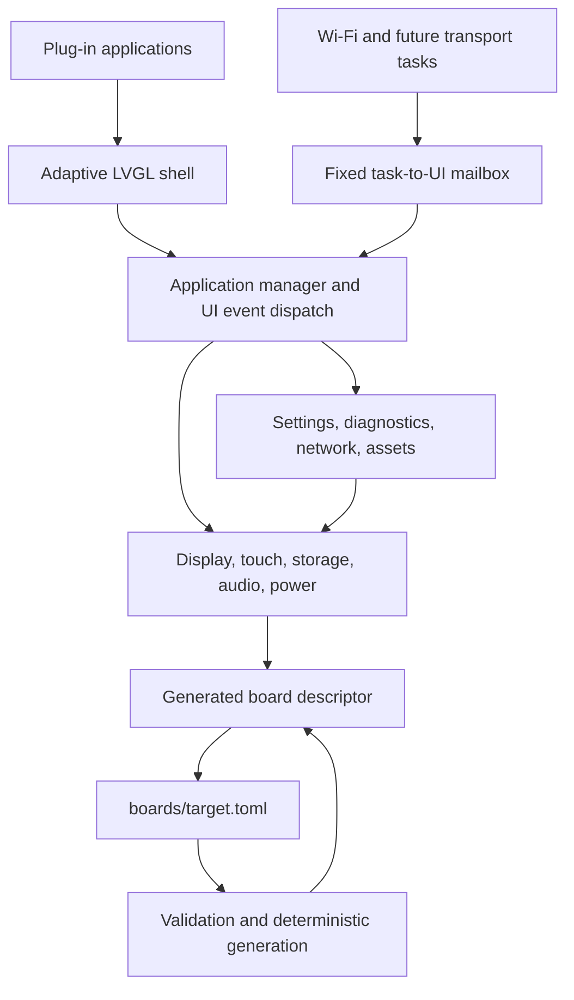

# Architecture

## Goals

EspScreenOS separates application behavior from physical board wiring. A target selection chooses a complete hardware capability manifest, not merely a display size. The generated descriptor supplies display bus type, panel driver, touch controller, storage mode, audio path, power sensing, exposed headers, memory geometry, polarity, and flash layout.

## Boot sequence

1. `FirmwareApplication` executes a declarative startup plan, first forcing hardware into its safe boot state.
2. Initialize NVS recovery and LVGL timing as separate cohesive foundation steps.
3. Load the compile-time generated board descriptor and reserve fixed GPIO and bus resources.
4. Start the display hardware and then its LVGL adapter. Either failure is fatal because no usable recovery UI exists.
5. Start touch, SD, power, and audio independently, then adapt available touch input to LVGL. Optional failures become degraded health records.
6. Start settings, assets, diagnostics, and networking through `ServiceManager`.
7. Register applications and activate the launcher’s default application.
8. Transfer control to `RuntimeLoop`, which drains cross-task events, samples services, advances the shell, runs LVGL timers, and applies bounded frame delays.

NVS and LVGL foundations are transactional lifecycle components. If any later critical boot step fails, reverse-order rollback deinitializes both frameworks; repeated starts are idempotent, and a corrected configuration can retry boot without double-initializing process-global SDK state. Hardware safety intentionally has no rollback, so the motor output remains forced off throughout failed startup.

## Runtime boundaries

### Core

`espscreen_core` has no ESP-IDF or UI-framework dependency. It provides fixed-capacity collections, status values, the synchronous event bus, a task-to-UI mailbox, lifecycle managers, and narrowly owned ports. `application.hpp` contains only application lifecycle and surface contracts; the independently consumed `ISettingsStore` lives in `settings_store.hpp`, so services and UI do not import application orchestration transitively. Activation passes an opaque `ApplicationSurface` value directly; renderer adapters alone convert it to a native LVGL root. Stop, tick, and event delivery carry no ambient context. Registries do not use `std::vector`, `std::map`, `std::function`, exceptions, or RTTI.

`RuntimeLoop` owns framework-independent frame scheduling and animation pacing. Its work, UI timer, clock/delay, and telemetry ports are supplied by the composition root, making timing behavior deterministic in host tests without introducing an SDK dependency into core. The portable `IMonotonicClock` is the common time port; `IRuntimeClock` extends it only with the delay operation needed by frame scheduling. The composition root owns one `FirmwareClock` adapter and shares it with runtime scheduling, service lifecycle health, diagnostics, boot-event timestamping, and shell power policy. Touch sampling is a separate `IShellInput` port rather than an unrelated clock/input bundle. LVGL's context-free tick callback remains isolated at the SDK-facing foundation boundary.

`execute_startup_plan` gives boot ordering explicit data semantics. Critical failures roll back completed steps in reverse order; optional failures are reported through an observer and boot continues. Lifecycle-shaped components are bound through the type-safe, allocation-free `startup_step` factory, which derives rollback support from the presence of `stop()`. The stronger `transactional_startup_step` additionally cleans a partially initialized candidate when its own start fails; hardware devices use this declaration instead of duplicating callback pairs. Explicit callbacks remain only for stages with custom start or failure policy. `FirmwareApplication` owns the concrete firmware object graph and adapts its platform, applications, SD discovery, and shell startup to that portable policy.

Service and application registries accept prevalidated batches, so duplicate IDs, null entries, or capacity failures cannot leave half-registered composition state. The shared, framework-independent `ComponentLifecycle` policy gives single-threaded components—including the service manager, shell, settings, and assets—one acquire/retry/release vocabulary: failed acquisition returns to stopped, successful start can be treated idempotently by leaf components, and release occurs at most once. Cross-task adapters use the matching `AtomicComponentLifecycle`, which centralizes the same transition policy and acquire/release ordering for the job executor, network transport, and provisioning server. Domain-specific application activation retains its specialized state machine because its rollback semantics differ. Service lifecycle is independent of active-prefix bookkeeping. Service catalogs are immutable throughout startup and while running—even when empty—so registration returns a conflict instead of accepting an inert or reentrantly added service. Application lifecycle state is likewise explicit: activation is a guarded transaction, nested activation and registration during a transition are rejected, and no stopping or partially started application is exposed as active. Failed candidates and failed attempts to restore the previous application both quiesce background work and tear down partial state. Service startup rejects reentry; a fatal candidate cleans its own partial state before previously started services roll back, while optional failures may deliberately continue as degraded participants. Startup rollback clears stopped registries, allowing a failed boot to be retried against the same object graph. SD discovery likewise stages candidates before committing them as one batch.

`HardwarePlatform` uses the same startup-plan semantics for resource reservations and device initialization. Its single lifecycle-plan factory is interpreted forward for startup and in reverse for normal shutdown, preventing duplicated device-order lists from drifting as capabilities are added. A bounded `StartupSession` records exactly which declarations completed, so shutdown skips unavailable optional devices and repeated shutdown is inert rather than depending on every adapter being accidentally idempotent. Resource, haptics, and display failures are critical and roll back prior steps; touch, storage, power, and audio are optional, but each adapter releases partially acquired SDK resources before startup continues.

Display allocation and transfer strategies are separated from both frameworks. The pure `DisplayBufferPlan` declares buffer sizes, a maximum SPI transfer size large enough for either direct render buffers or staging chunks, and the ordered fallback from paired internal DMA render buffers to paired external render buffers with a distinct internal staging buffer. The pure `DisplayTransferArea` and `staged_display_transfer_chunk` policy calculate bounded staging chunks, source offsets, byte counts, and exclusive panel coordinates. A staging buffer that cannot hold one complete row yields no chunk instead of permitting an oversized copy. `DisplayDevice` interprets only panel-transfer and synchronization mechanics and returns a typed completed/pending result. `FirmwareLvglDisplay` owns render-buffer placement, LVGL registration, byte-order adaptation, and callback translation. HAL therefore has no LVGL dependency, while buffer and transfer policy remains host-testable without either framework.

### Board support

`espscreen_board` is a passive, header-only descriptor component. It has no lifecycle, mutable resource state, or dependency on core behavior. The selected target is generated into `generated/<board>/include/espscreen/generated/selected_board.hpp` before ESP-IDF configures the project. Only the firmware composition root resolves that generated selection; `HardwarePlatform` accepts a borrowed descriptor explicitly and can therefore be assembled from alternate descriptor data without hidden global discovery.

Portable resource-leasing policy lives in the independent `espscreen_resources` component. HAL interprets a board descriptor into a declarative `BoardResourcePlan`, while both HAL and expansion management consume the same broker without placing behavioral ownership in the descriptor layer.

Expansion bus identity is also descriptor data. Each I2C, SPI, or UART header names its concrete `BusHost`; the pure `header_resource_key` projection converts that declaration into a lease key. Expansion management contains no target-specific fallback bus numbers, and profile validation rejects missing or incompatible hosts before code generation.

Digital audio follows the same rule: `AudioConfig` declares separate codec-control and sample-data hosts. The pure `AudioHardwarePlan` exhaustively maps `none`, PWM, codec-backed I2S, and direct I2S drivers to validated startup strategies, controller indices, and supported sample rates. Both the ESP adapter and board resource planner interpret that plan, so invalid hosts cannot silently fall back to controller zero, direct I2S cannot accidentally execute codec initialization, and the fixed ES8311 clock program cannot be applied to an incompatible rate. `Es8311Codec` is a cohesive child component that exclusively owns the codec-control I2C lease and transactional register programming; `AudioDevice` composes it with the sample transport rather than duplicating codec lifecycle state. Its 22-command startup sequence, including the reset delay, is immutable declarative data with compile-time host coverage. Validation rejects digital-audio profiles whose declared hosts do not match the required bus families.

All descriptor bus identities share the pure `bus_family` and `bus_index` projection. Display, touch, storage, audio, expansion, and fixed-resource planning use that single mapping; adapters check the required family before touching the SDK. A malformed host therefore remains invalid instead of being coerced to SPI2, SPI3, or I2C0, and profile validation catches the same mismatch before generation.

### HAL

Hardware startup is a declarative sequence of typed transactional components. Fixed resource reservation and optional haptics each own their acquire/release behavior, so `HardwarePlatform` no longer publishes bespoke callback/context thunks or mixes rollback mechanics into its composition plan.

`espscreen_hal` owns electrical behavior. Applications do not instantiate SPI, I2C, ADC, I2S, or display drivers. HAL drivers translate the descriptor into ESP-IDF configuration and retain independent health states. Shared I2C access crosses the narrow `II2cBus` port; `HardwarePlatform` owns one `EspI2cBus` adapter and injects it into touch and audio devices. The deterministic `I2cLeaseTable` decides whether an acquisition initializes hardware, reuses a compatible configuration, or conflicts, and whether release requires teardown. The ESP adapter only interprets those decisions and rolls the lease back if SDK initialization fails. Reference counts and electrical configuration therefore belong to the hardware object graph rather than mutable process-global state, and alternate bus implementations can be substituted without changing either device.

Concrete HAL devices do not publish provider-shaped interfaces merely mirroring all of their methods. Polymorphic boundaries are owned by actual consumers: for example, `HapticsController` remains a concrete member of the hardware object graph, while its edge adapter implements the narrow `IApplicationHaptics` contract required by applications.

### Services

Service criticality is deployment policy expressed by declarative `ServiceRegistration` records at the composition boundary, not a property of reusable service implementations. The same service can therefore be optional in one product and critical in another without modification.

Services add persistent settings, filesystems, networking, telemetry, power policy, and future remote transports. Optional services may start in a degraded state. A critical service failure causes deterministic rollback of previously started services. Required collaborators are constructor-injected and `start`, `stop`, and `tick` carry no empty ambient context. The component is SDK-free: settings and assets depend on the consumer-owned `ISettingsBackend` and `IAssetStore` ports, while runtime adapters implement NVS and SPIFFS mechanics. Settings writes have explicit synchronous durability rather than an implicit worker queue with shutdown races. `DiagnosticsService` depends on its consumer-owned `IDiagnosticsSource` and the injected lifecycle clock; the runtime adapter maps HAL-specific samples and device states into stable `core::SystemTelemetry` values. Lifecycle admission makes diagnostics ticks inert before start and after stop, while preserving clean retry. This makes sampling cadence and publication host-testable while keeping services independent of HAL and board components. `NetworkService` loads and saves the domain value `WifiCredentials` through the semantic `INetworkSettings` port; it has no knowledge of persistence keys or partial-write recovery. `SettingsService` owns backend lifecycle and exposes only generic scalar and `ITextSettings` operations; it has no networking dependency. The injected `WifiSettings` adapter alone owns credential keys and transactionally restores the previous SSID if password persistence fails, separating storage mechanics from the network-specific schema. The bounded `parse_wifi_credentials` function owns URL-form decoding and validation independently of HTTP. Credential persistence has no actuator or restart side effects: the HTTP edge requests restart through `ISystemRestart` only after sending its success response, and `FirmwareSystemRestart` owns the platform-specific safe-shutdown preparation and ESP restart call. `NetworkConnectionPolicy` owns connection, provisioning, bounded retry, failure, and stop transitions. The service drives the consumer-owned `INetworkTransport` port, so its complete station, provisioning, reconnect, and shutdown behavior is host-testable without ESP-IDF. Connection callbacks use the narrow `INetworkConnectionObserver`, while HTTP credential submissions use the separate `IWifiProvisioner`; event observation and command handling no longer share a bidirectional interface. The service's lifecycle gate rejects late callbacks after shutdown, independently of the transport adapter's callback withdrawal. `FirmwareNetworkTransport` is now an ESP-independent coordinator over two injected edges: the consumer-owned `IWifiPlatform` port and the narrow `IProvisioningServer` port. Its host tests cover delegation, startup retry, AP failure short-circuiting, connected/disconnected event translation, and stale-callback suppression. `FirmwareWifiPlatform` alone owns ESP Wi-Fi initialization, netifs, event registrations, SDK configuration structures, and callback translation into typed platform events. The service composition boundary owns and injects both concrete adapters, making either edge replaceable without changing network orchestration. Each layer has an atomic lifecycle: the coordinator withdraws service collaborators before stopping its edges, and the Wi-Fi adapter withdraws its event sink before unregistering SDK handlers and releasing netifs. Partial startup failures therefore converge on their owning layer's cleanup path, and callbacks cannot target a failed or stopping coordinator. `FirmwareProvisioningServer` follows the same guarded lifecycle: its route table is declarative, every route registration is checked, and any partial HTTP startup is torn down and returned as a `Status` to the network service. Shutdown releases resources in reverse order, and repeated connected events cannot create duplicate servers. HTTP callback signatures and request structures are confined to the implementation translation unit: a private friend trampoline recovers the adapter instance from route context, while the public adapter header remains free of ESP HTTP types and process-global state.

### UI and applications

Audio and storage access follow interface segregation. Tone requests, capture, and playback are distinct consumer-owned ports: Hardware Test depends only on `IApplicationTone`, while Recorder depends only on `IApplicationAudioInput` and `IApplicationAudioOutput`. Storage location and storage status are likewise separate: filesystem adapters consume `IApplicationStorageLocation`, while Hardware Test consumes `IApplicationStorageStatus`. Edge adapters may implement multiple roles against one physical device without broadening consumer contracts.

There are no umbrella capability headers. Each consumer imports its exact role contract, so adding a capability cannot silently enlarge unrelated compile-time dependencies.

All stable application dependencies—board metadata, GPIO, memory, text files, jobs, settings, storage, haptics, and audio—are non-null constructor dependencies of their owning coordinators. Allocation, I/O, scheduling, and device availability are reported by operations rather than adapter-pointer presence. `AppManager` owns the scheduler needed by transitions, so rollback and stop quiescence are unconditional lifecycle rules. A named `BuiltinApplicationDependencies` record keeps the explicit object graph declarative. The only execution-scoped input is the surface value supplied to `start`; `AppManager` validates it before entering a transition. The obsolete mutable `AppContext`, capability bitmask, and service-locator preflight have been removed.

The shell coordinates the active surface, content root, and application lifecycle. Its explicit lifecycle makes view construction, event subscription, and initial application activation one transaction: an activation failure is propagated, acquired subscriptions are released, and the same shell can be retried. Runtime ticks and delivered events are ignored outside the running state. Cohesive views own their LVGL widget subtrees and report semantic actions through one typed `IShellActionSink`; C callback/context pairs terminate inside the LVGL adapters and do not cross the semantic view port. Views do not reach into shell state. `HeaderView` and `StatusView` share a narrow telemetry presentation model. `NavigationView` owns dock selection rendering, `SettingsView` renders a typed settings model, and `DrawerView` renders an allocation-free application catalog. Each emits typed intent while persistence, navigation policy, and application activation remain controller responsibilities. The pure `ShellPresentation` projection maps navigation transitions to complete visibility and animation data; one LVGL renderer applies it, preventing surface methods from accumulating contradictory widget mutations. Display and feedback effects cross the consumer-owned `ShellCapabilities` boundary; the runtime adapter translates those requests to hardware. Consequently, `espscreen_ui` has no HAL or services dependency. `ShellSettings` owns preference rules and side-effect classification. `ShellInputPolicy` owns press-edge detection, drag thresholds, direction dominance, and surface-specific gesture interpretation. Both are deterministic and host tested. A pure `ThemePalette` is the single declarative color source for every view. LVGL transition descriptors are instance-owned as well: `ShellView` constructs its `ButtonStyle` with the widget tree, shares it explicitly with lazy view construction and content decoration, then releases it during reset. Motion helpers retain no mutable namespace state or hidden initialization order. An application owns only the children and callback bindings it creates under the content root; mutable interaction state is instance-owned rather than stored in namespace globals. Stable dependencies belong in constructors, while the content surface is passed only to activation. Application behavior that does not require rendering belongs in framework-independent models such as `CalculatorEngine`, leaving the LVGL application as a thin adapter. `AppManager` stops the current app before starting the next and restores the previous app if activation fails.

`ShellActionPolicy` is the pure reducer between view/input actions and controller effects. It produces bounded command plans, including ordered multi-effect interactions such as closing status before opening settings or adjusting then persisting brightness. `Shell` interprets those commands; callback adapters contain no navigation or persistence branching. `ShellSettings::persisted_settings` is the single executable catalog for storage identity, model projection, bounds, encoding, and ordering. Framework-independent persistence functions interpret that catalog for best-effort restoration, full serialization with first-failure propagation, and theme-only writes; the shell no longer knows persistence keys or repeats storage loops. Its `settings` catalog likewise declares interactive title, model projection, slider domain, scale, side effects, and presentation. Both the pure mutation policy and LVGL view interpret that catalog, avoiding parallel field mappings, validation rules, and row construction.

`HardwareTestModel` owns declarative peripheral-test presets and maps typed commands to capability-independent effects. Its LVGL adapter only executes those effects and renders external success or failure, following the same framework-independent model pattern as `CalculatorEngine`. Interactive application view ports use narrow, typed action sinks owned by their coordinators. Calculator, GPIO, hardware test, notes, and recorder views retain only those interfaces, so LVGL callbacks terminate inside the rendering adapter and coordinators no longer publish static callback/context thunks. The Lua UI bridge follows the same rule: it retains `ILuaUiActions`, while `LuaApplicationRuntime` owns script invocation and depends only on the injected `ILuaUi` port. `LuaSdAppFactory` is the bounded composition point for UI/runtime pairs, so the script coordinator neither constructs nor names the LVGL adapter and withdraws its sink before closing the interpreter. Native and external UI actions therefore share the same dependency direction and lifetime model. Background work uses borrowed `IApplicationJob` objects whose lifetime is protected by transition quiescence; the bounded executor queues typed job pointers rather than reconstructing objects from function/context pairs. Only the FreeRTOS task-entry callback remains at the SDK adapter edge.

Applications request large or placement-constrained buffers through the consumer-owned `IApplicationMemory` port. The firmware adapter maps general and external-memory requests to ESP-IDF heap capabilities, leaving applications free of allocator headers and SDK component dependencies. Paint uses this boundary for its PSRAM canvas and releases the allocation during application teardown.

SD application discovery is split by responsibility: `SdAppLoader` enumerates directory entries and coordinates atomic registration through an `IExternalApplicationFactory` port; `LuaSdAppFactory` owns bounded pairs of portable applications and Lua runtime adapters; and the framework-independent path policy validates candidates and constructs bounded paths. Runtime text-file and directory adapters likewise share one pure `application_file_path` policy for segment validation, separator normalization, and capacity checks; platform I/O no longer duplicates those decisions, and both reject `.` and `..`. `ExternalApplication` owns metadata, path bounds, and transactional lifecycle behavior behind `IExternalApplicationRuntime`, while `LuaApplicationRuntime` owns only sandbox execution and its narrow widget API. Discovery checkpoints and restores the factory when enumeration or registration fails. Firmware composition wires the factory and decides whether discovery is enabled, so the portable loader and application coordinator do not depend on Lua, LVGL, `sdkconfig.h`, or build-feature macros.

Application selection and construction belong to the firmware composition layer. `FirmwareApplications` owns the registry lifecycle, built-in graph, and SD loader behind application-host and discovery ports. Its `FirmwareBuiltinApplications` child owns the cohesive view/coordinator pairs and catalog mapping. The portable `ConfiguredApplicationDiscovery` policy turns the SD feature flag and directory dependency into an ordinary startup component, propagating discovery failure only when enabled. Directory enumeration reports borrowed `ApplicationFileEntry` values through the typed `IApplicationFileVisitor` port; the SD loader implements that port as a bounded collector and no longer reconstructs object identity through a callback context. Candidate creation remains checkpointed and registration remains atomic, so visitation or commit failure restores the external-application factory. `FirmwareApplication` interprets feature macros once, supplies declarative feature values, and binds every subsystem—including hardware and optional discovery—through typed `startup_step` declarations rather than custom callback thunks. The applications component contains implementations and portable policies, not firmware configuration decisions.

Firmware service construction follows the same boundary. `FirmwareServices` receives a named dependency aggregate rather than a long positional constructor, and owns service-specific SDK adapters, concrete service instances, their ordered catalog, lifecycle manager, and runtime-work adapter. The outer composition root sees only startup/shutdown, the settings port consumed by the shell, and generic runtime work. This keeps service registration and rollback mechanics cohesive while making hardware, event, mailbox, haptics, and clock wiring locally reviewable.

`FirmwareCapabilities` projects an explicit named dependency aggregate into consumer-owned application and shell ports. It does not receive `HardwarePlatform` or discover dependencies through it; the composition root supplies the board descriptor, resource broker, individual devices, and input port by name. The projection owns board, storage, haptics, audio, GPIO, file, memory, display-control, and feedback adapters and declaratively assembles `ShellCapabilities`. Framework registration lives in separate root-owned edge adapters: `FirmwareLvglDisplay` adapts display transfers and `FirmwareShellInput` adapts touch samples. Both hardware devices stop at electrical operations and semantic data, remaining independent of LVGL. Service composition and SD discovery request only their narrow haptics or directory ports rather than reaching through the hardware object graph.

`FirmwareShell` owns the concrete `ShellView`/`Shell` pair and its UI-start failure cleanup. The outer root binds it as an ordinary lifecycle component and includes only its generic runtime-work port in the frame sequence; LVGL view ownership and shell-specific recovery no longer leak into boot orchestration.

## Tasking model

LVGL calls occur only on the `app_main` task. Diagnostics are sampled from that task. Applications submit immutable `ApplicationJob` values through the consumer-owned `IApplicationJobs` port rather than creating RTOS tasks or passing parallel callback/context arguments; `FirmwareApplicationJobs` queues that same core value without declaring an adapter-specific duplicate. Its bounded executor closes admission before draining, while each submit joins the pending count and rechecks admission before touching the queue. Shutdown therefore waits for both queued work and in-flight submissions before deleting RTOS resources. Notes and Recorder share the typed, framework-independent `AtomicCommandSlot`, which centralizes empty/reserve/take/reset semantics and their memory ordering while their domain policies decide which commands are valid. Coordinators reserve a command before mutating worker-visible payload: Notes therefore claims its slot before copying editor text, so a rejected second save cannot corrupt the in-flight transfer buffer. Wi-Fi callbacks and future background transports post small `Event` values to `EventMailbox`; the UI loop drains the mailbox before dispatching through `EventBus`.

Event payloads are typed. Synchronous subscribers implement `IEventObserver`; `IEventSource` retains those typed collaborators instead of function/context pairs, and `EventBus` snapshots its bounded subscription table before dispatch so an observer may unsubscribe itself without invalidating traversal. Consumers depend independently on `IEventSource` or `IEventSink`; the concrete bus implements both without an unused combined interface. Borrowed telemetry snapshots are valid only for synchronous `EventBus` publication, and `EventMailbox` rejects them rather than relying on caller-managed pointer lifetimes. Mailbox consumers likewise request only `IEventInbox` or `IEventOutbox`, with no aggregate mailbox abstraction. Cross-task events carry value fields only. High-rate data belongs in a service-owned snapshot or bounded ring buffer, with the queued event carrying only an index or generation number.

## Display memory model

Classic ESP32 targets normally allocate partial LVGL buffers from internal DMA memory. S3 targets can allocate larger draw buffers from PSRAM. PSRAM is not assumed to be a valid panel DMA source. When a draw buffer is not DMA-capable, the flush path copies bounded row chunks into a distinct internal `MALLOC_CAP_DMA` staging buffer and waits for each transfer completion before reusing it.

This design avoids full-frame allocation, keeps transfer memory bounded per board profile, and prevents the common failure where an LVGL canvas renders correctly in memory but the SPI peripheral reads an invalid source.

## Resource ownership

Resources are identified by kind and index, such as GPIO 21, I2C bus 0, or SPI bus 3. A lease is exclusive or shared. Re-entrant leases are reference-counted per owner, so one shared owner cannot accidentally release another owner’s reservation.

Fixed display GPIO is exclusive. Shared control I2C and expansion SPI buses can be leased in shared mode while chip-select and device-level rules remain the caller’s responsibility. Direct GPIO access to a pin already committed to a fixed bus is rejected.

## Failure policy

| Capability | Boot policy | Runtime representation |
|---|---|---|
| Display and core runtime | Critical | Boot stops and logs the failure |
| Touch | Optional | Launcher remains usable through remote control or later recovery |
| SD card | Optional/removable | `degraded` or `absent`; mount can be retried |
| Battery/ambient ADC | Optional | Values are `-1` and health is degraded |
| Audio | Optional | Tone/PCM calls return `unavailable` |
| Asset partition | Optional | Built-in UI remains available |
| Network | Optional | Local applications continue offline |

## Extension points

- Add a board through a TOML profile and, only when needed, a new HAL driver enum and factory branch.
- Add an application by implementing `IApplication` and registering it.
- Add a service by implementing `IService` and registering it in lifecycle order.
- Add a remote transport by adapting bytes to the COBS/CRC framed protocol and `RpcRouter`.
- Add an expansion device by leasing its named bus/header and publishing service-owned snapshots.

## Dependency rules

Dependencies point inward toward contracts and policy. In particular:

- `core` contains portable lifecycle and messaging contracts and depends on no framework or device SDK.
- Board descriptors are passive data: the board component has no mutable behavior or core dependency. HAL consumes descriptors and owns their translation into resource plans.
- Portable resource leasing is isolated in `espscreen_resources`; HAL and expansion management depend on it directly instead of acquiring behavior transitively through board data.
- HAL owns ESP-IDF device APIs. Services and applications use HAL capabilities instead of SDK handles.
- Services own long-lived state and background work. UI code observes snapshots and emits intent.
- UI policy is expressed as deterministic C++ state machines where possible. LVGL views adapt policy outputs to widgets, and the composition root adapts them to hardware.
- `FirmwareApplication` is the composition root reached by the deliberately tiny `main/app_main.cpp`. Concrete construction and build-feature selection belong there; domain components must not reach back into it or locate global services.
- Lifecycle calls carry no ambient context. Long-lived service dependencies, including monotonic time, and application capability ports use constructor injection.

Cross-component abstractions live with their consumer, following dependency inversion. A provider implements the consumer's narrow contract rather than forcing the consumer to depend on the provider's concrete type. New behavior should be introduced behind a port when it crosses an SDK, storage, clock, transport, or UI-framework boundary.

Build metadata follows the same rule: only contracts used by public headers are exported through component `REQUIRES`. LVGL, Lua, and ESP-IDF driver libraries are private dependencies of their concrete adapters, preventing those frameworks from leaking transitively into otherwise portable consumers.

## Refactoring roadmap

The architecture is migrated incrementally, keeping firmware usable after each step:

1. Extract deterministic policies from the LVGL shell. Display idle behavior is the first such boundary: `DisplayPowerPolicy` owns awake/dim/off transitions while `Shell` supplies time and applies the requested backlight level.
2. Replace `AppContext`'s untyped dependencies with consumer-owned capability ports, then remove the context itself. Applications now receive stable board information, GPIO, audio, haptics, storage, and settings through constructor-injected ports; activation receives only an opaque surface value. Hardware adapters implement those ports, so applications no longer include the platform or call ESP-IDF GPIO APIs directly.
3. Split shell presentation into cohesive views coordinated by a small shell controller. Navigation transitions live in the pure `ShellNavigation` state machine, so exactly one application/drawer/settings/status surface is active. `HeaderView`, `StatusView`, `NavigationView`, `SettingsView`, and `DrawerView` own their widget trees and callback storage, consume explicit input, and emit typed semantic actions without knowing the shell. Shared visual constants live in `ThemePalette`; `Shell` now owns only the application content root directly.
4. Move boot orchestration and the frame loop from `app_main.cpp` into explicit runtime/composition objects with injected clocks. `FirmwareApplication` now owns declarative startup and the concrete object graph, while the portable `RuntimeLoop` owns frame scheduling. `app_main` only starts the application and transfers control.
5. Add host contract tests for each new policy and fake-driven integration tests for lifecycle rollback, navigation, settings, and degraded hardware. LVGL rendering and board builds remain separate integration gates.

During migration, avoid generic service locators, new mutable globals, and abstractions that merely mirror a concrete SDK API. Each extraction should either remove a dependency, make a policy independently testable, or give one responsibility a clear owner.
